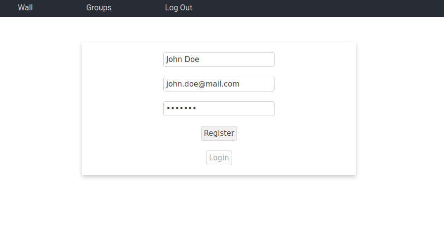
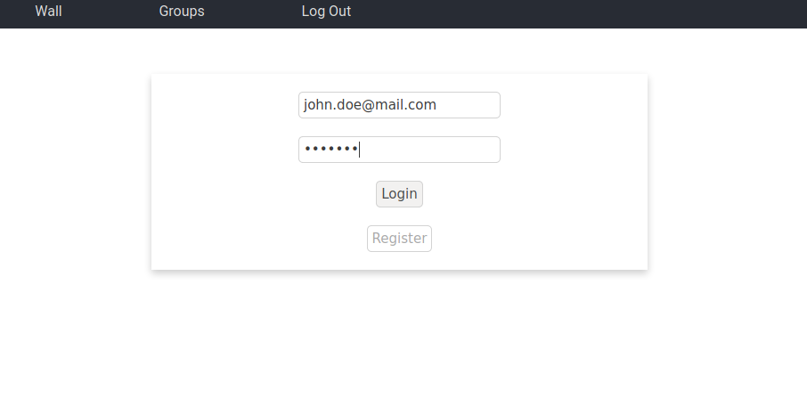
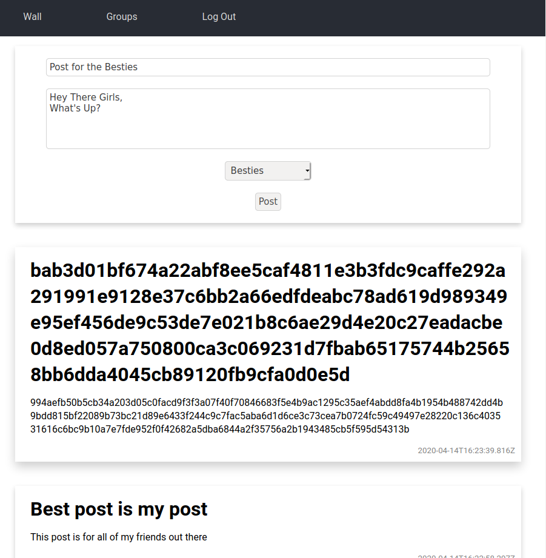
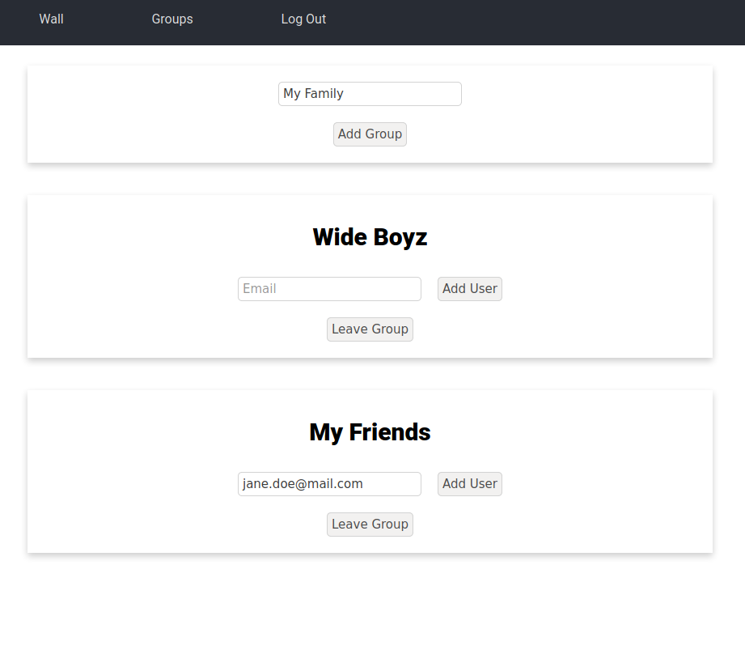

# Securing Social Media Applications

###### Michael McGuinness | 16322635 | Git Repo: https://github.com/DaVinciTachyon/EncryptWall | Demo : https://youtu.be/XMerDEcikcM

### **Assignment Brief**
The aim of this project is to develop a secure social media application for Facebook, Twitter, WhatsApp, etc., or for your own social networking app. For example, your application will secure the Facebook Wall, such that only people that are part of your “Secure Facebook Group” will be able to decrypt each other’s posts. To all other users of the system the post will appear as ciphertext.  
You are required to design and implement a suitable key management system for your application that allows any member of the group to share social media messages securely,and allows you to add or remove people from a group. You are free to implement your application for a desktop or mobile platform and make use of any open source cryptographic libraries.

### How to Use
```
git clone https://github.com/DaVinciTachyon/EncryptWall.git
cd EncryptWall/
sudo docker-compose up
```
Then in another terminal, starting in the `EcryptWall/` directory.
```
cd frontend/
npm install
npm start
```
The website is then accessible through a browser at the address: `localhost:3000/`

<div style="page-break-after: always;"></div>

### **Solution**
I understood the task to require the creation of user accounts that can be members of groups. Each of the users has a wall which allows them to see all of the posts, however will decrypt only the ones that are directed to a group they are a member of. Users may be members of multiple groups.  
The solution is split into a front-end, a back-end and a database. This is for easy separation of the mechanics of the system, as well as for security reasons.  
The front-end was built in React js, and it is a website which allows the users to interact with the application in a reasonable manner.  
The back-end was built using Node js. It was built in an api format using the express framework. The reason for this is for ease of communication with the front-end, as well as the ability to expand to having multiple front-ends in the future.  
The database was built using mongodb. This was mostly because of the ease of communication between a node server and mongodb. The liberty to use a nosql database was due to the database not needing to record transactions in a specific order and the relatively small size of the project.

<div style="page-break-after: always;"></div>

### Front End
The front end is a website built in React js. It acts as an interface for the application.
The application is composed of 4 pages:
- The registration page
- The login page
- The wall
- The groups admin page

#### Registration Page
This page allows a user to register for the application. It is composed of a form which takes in a name, email and password. There is some basic validation in the front-end. Then if that validation is passed these pieces of information are sent to the back-end. It will also do some validation. If a requirement is failed, the front-end will get a message and display the reason for the failure, so that the user may correct it. If all of the values are correct, the registration will go through and the registration page will redirect to the login page.


<center>John Doe Registering</center>

<div style="page-break-after: always;"></div>

#### Login Page
This page allows an existing user to access the application. It is composed of a form that accepts an email and password. There is some basic validation in the front-end. If the information is valid it is sent to the back-end. There the information has some more validation, if some of the validation is not passe, the message is returned and displayed in the front-end. If the validation is passed, the given email and password are checked against existing users. If one is not found, an error is returned, otherwise a json web token is returned which allows the user to use features that only exist if logged in.


<center>John Doe Logging In</center>

<div style="page-break-after: always;"></div>

#### The Wall
This page has two functionalities:
- making new posts
- seeing previous posts


<center>Jane Doe's Wall - she was added to the <i>My Friends</i> group</center>

##### New Posts
At the top of the page there is a form. This form accepts a title, some content and a group to post for. There is some basic validation. If this validation is passed, the information is sent to the back-end where the post is stored.

##### Past Posts
Underneath the form, all of the previous posts on the platform are shown. By default the posts are shown as cyphertext, i.e. they are not decrypted, they are simply sent in their encrypted format. The other posts are posts from groups the user is a member of. These are decypted and shown to the user in plain text.

<div style="page-break-after: always;"></div>

#### Groups Admin Page
This page has two functionalities:
- creating new groups
- administration of current groups


<center>John Doe's Groups</center>

##### New Groups
At the top of the page there is a form which simply accepts a name. This name is sent to the back-end which creates the group and makes that user a member of the group.

##### Current Groups
Underneath the form, there is a set of cards, one for each group the user is a member of.
These cards allow administration of the groups in two ways. They allow the user to remove itself from the group. As well as add other users to the group by email.

<div style="page-break-after: always;"></div>

### Back End
The back-end was built in Node js using the express framework, which allowed it to easily create an api for the front-end to connect to.  
There were four main areas for it to take care of:
- handling the database
- authorisation of users
- posts
- groups

#### Database
There were two main parts to connecting to the database. These were:
- creating the database
- connecting to the database

In order to achieve these two goals a few tools were used.  
The first tool was `docker`. A docker file was created for the node server. This was then imported into a docker-compose file. This was used to create an easy way to connect the server and the database. This also creates a database if it does not exist. It also makes development and deployment a lot easier.  
The second tool used was a library for node, `mongoose`. It allows for ease use of a mongo database in node.

#### Authorisation
Authorisation has 3 parts:
- Registration
- Logging In
- Token Verification

For registration and logging in two routes were created.

##### `/auth/register`
This route needs to be contacted through a post request.  
A validator was written for the values than need to be in the body of the request using `@hapi/joi`. This allows the information to be verified as fitting the right format before it is even processed. It also helps create errors which can be sent to the requester. Then the given email is run against the database to check if it already exists. If it does not exist, the password is encrypted with a randomly generated salt in one way encryption using the library `bcryptjs`. This makes it so that the password cannot be decrypted, or it is at least very hard. The new user's name, email and hashed password are then added to the database using the User model.

<div style="page-break-after: always;"></div>

##### `/auth/login`
This route needs to be contacted through a post request.  
A validator was written for the values than need to be in the body of the request using `@hapi/joi`. This allows the information to be verified as fitting the right format before it is even processed. It also helps create errors which can be sent to the requester. Then the email is looked for in the database. If it is found, the unhashed password given in the post request is compared to the hashed password found in the database using the `bcrypt.compare()` function. If this comparison is successful, a json web token is created which contains the user id, using the `TOKEN_SECRET` found in the .env file. This is sent to the requester in order to confirm a successful login, and to allow them to use the token to access routes which need verification.

##### Token Verification
In order for the service to actually be secure, routes need to be accessible only by logged in members. For this purpose, a middleware was created to verify that the token is valid.
This middleware starts by checking that the token is contained in the request header. If it is the token is verfied using the `jwt.verify()` function, which processes the token alongside the `TOKEN_SECRET`. If this is successful a new parameter for the request is updated, `req.user`, with the user id and few othe pieces of information. Then the function `next()` is used to move onto the actual route processing.

#### Posts
In order to handle posts, 2 routes are created. All of these routes require token verification.

##### `/post`
This route is used to add a new post. This endpoint is contacted using a post request. It uses the secret key for the group it posted for to encrypt the title and content. The encypted post is then save to the database.

##### `/posts`
This route is used to get all of the posts. This endpoint is contacted using a get request. The way it works is that it gets all of the posts from the database. It then decrypts the posts written for groups the requester is a member of using the appropriate keys, and send them to the requester.

<div style="page-break-after: always;"></div>

#### Groups
In order to handle groups, 4 routes are created. All of these routes require token verification.

##### `/myGroups`
This route is used get all of the groups a user is a member of. This endpoint is contacted using a get request. The set of ids of the groups the user is a member of, is used to get the groups names, and all of that information is returned to the requester.

##### `/myGroups/add`
This route is used to add another user to a group. This endpoint is contacted using a post request. The body contains a group id and an email. The group id is added to the list of groups the user with the given email is a member of, if one if found.

##### `/myGroups/remove`
This route is for a user to remove themselves from a group. This endpoint is contacted using a post request. The request body contains a group id. This is used to remove this id from the list of groups the user is a member of.

##### `/group`
This route is used to create a new group. This endpoint is contacted using a post request. The request body contains a group name. A secret is created for the group by generating a random alphanumeric string 32 characters long, this is encrypted using the `POST_SECRET` in the .env file. The Group model is used in order to add the group to the database. The requester's user id is then used to add the group to the groups they are a member of.

<div style="page-break-after: always;"></div>

### Encryption and Key Management

Security within the application involves a few steps.
1. The traffic between the front-end and back-end would be encrypted using https traffic.
2. In order to access the endpoints which may give out sensitive information the requester needs a json web token which is processed using the `TOKEN_SECRET`, making it very secure and hard to fake.
3. The back-end has a `POST_SECRET` stored in the .env file. This is used to encrypt the key for each group in the database, which allows extra security in the case where an attacker manages to get access to the database. This stops them from simply using the stored keys to decrypt posts.
4. Each group has a different key which is used to encrypt the posts for that group.

As stated above, one way encryption is achieved using the `bcryptjs` library. This uses the inbuilt `crypto` library and uses its randomBytes interface is used to obtain secure random numbers to aid the encryption.
Two way encryption is achieved using the `cryptr` library. This library uses the *aes-256-gcm* algorithm to encrypt and decrypt *UTF-8* strings. The salt and iv are randomly generated and prepended to the result. The library is used by passing a secret in order to create the class, `Cryptr(secret)`, then `cryptr.encrypt()` and `cryptr.decrypt()` can be called.

### Potential Improvements
There are a few improvements I may have implemented given the time.
1. Improving validation would prevent many issues and attacks. Making it more thorough and making sure that no invalid information can get passed.
2. Taking more control of the encryption. Researching the best algorithms for the jobs they need to fulfill.
3. Using public and private key algorithms in order to make he application more secure. This would complicate the execution of the application as well as potentially change how it would be used.
4. Store less information in the database.
5. Making the server as simply a way to make the service more reliable rather than being used to store information would be a way to make the information more secure.